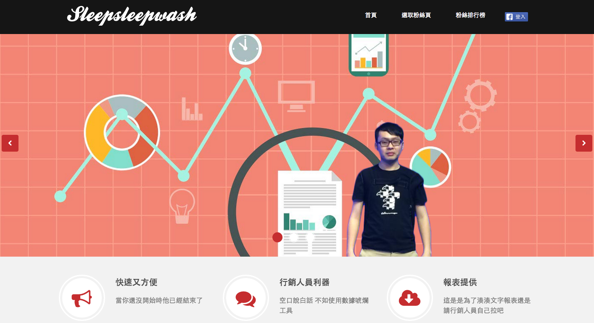

===

標題: 粉絲團工具-2014
標籤: 黑客松作品

===

## 簡介

參加 [黑客松](https://hackathon.tw/) 的作品，主要負責全端。

選取粉絲團，藉由 facebook 的 API取得資料，經過整理後排序，並且產出報表。

[github](https://github.com/washwashsleep/facebookRank)

---

## 頁面呈現

## 我的夥伴

[Wayne](https://github.com/wayne1025)
[Simon](https://github.com/SimonSun1988)