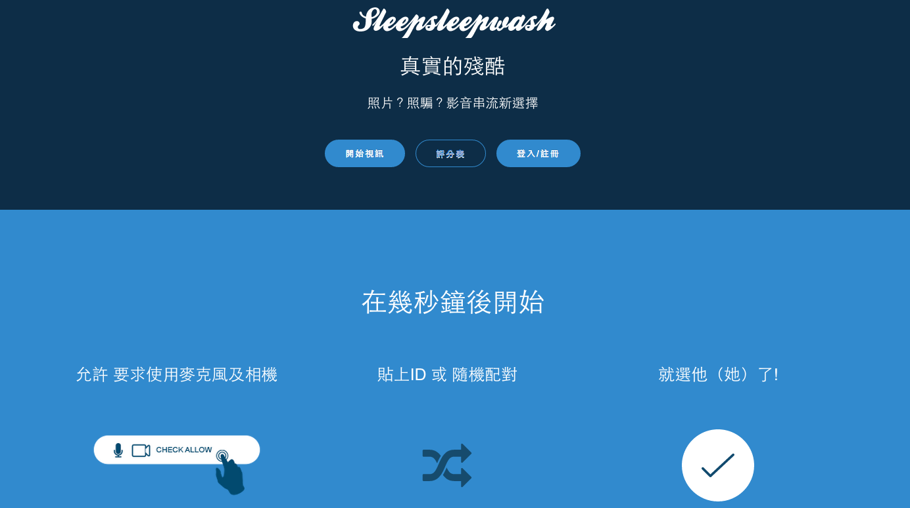

===

標題: 真實的殘酷-2015
標籤: 黑客松作品

===
## 簡介

參加 [黑客松](https://hackathon.tw/) 的作品，主要負責全端。

透過 webRTC 來做聯繫，使用 peerjs 來做點對點的連接，登入的人可隨機與陌生人連線 30秒，喜歡即可留聯繫方式，不喜歡就挑下一個。

[github](https://github.com/washwashsleep/true-life)

---

## 頁面呈現

## 我的夥伴

[Wayne](https://github.com/wayne1025)
[Simon](https://github.com/SimonSun1988)