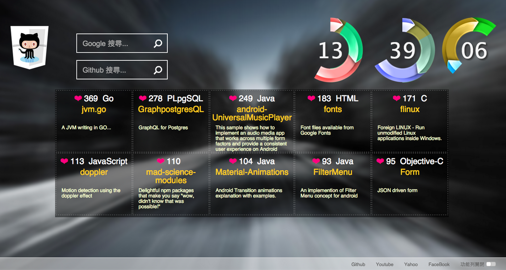

===

標題: 擴充套件[github趨勢]-2015
標籤: 黑客松作品

===
## 簡介

參加 [黑客松](https://hackathon.tw/) 的作品，主要負責全端。

做一個 Chrome Extension 的擴充套件，讓工程師們更有效率的取得最火紅的資訊，使用 cron 做自動更新。

[github - 擴充套件](https://github.com/washwashsleep/gitTrendingTab)

[github - API](https://github.com/washwashsleep/githubTrending)

---

## 頁面呈現

## 我的夥伴

[Wayne](https://github.com/wayne1025)
[Simon](https://github.com/SimonSun1988)