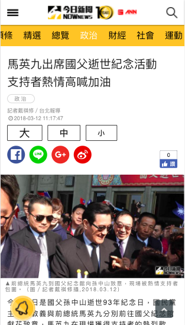

===

標題: 某新聞手機版
標籤: 專案類型

===

## 簡介

使用 node + express + nunjucks 打造手機版頁面及應用方式。

靜態資源使用 bower + gulp 做下載及打包，前端使用 muicss 做排版，資料使用 api 串接方式，頁面搭配設計師風格調整。

此專案 2-3 人開發，我主要負責架構及頁面，從中更理解 nginx 使用負載平衡的相關知識。

---

## 頁面呈現

